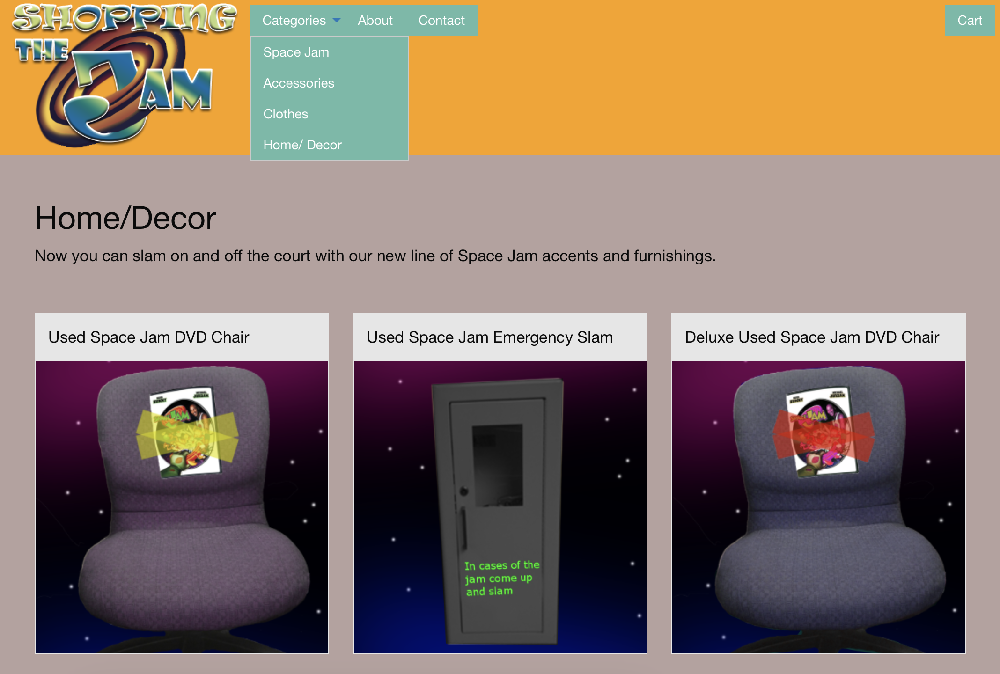

> It feels like everyone has a website nowadays. So why is it so hard for me to make one?

That was the mindset I struggled with for a big part of my life as an aspiring software developer. I knew I had the skills required, but every time I resolved to finally bring an idea to fruition, I rode the high of motivation for a few days before running out of steam and filing my code away, never to see the light of day. And it wasn't just the website, the same disappointing rerun played out for project after project. Was I just not motivated enough? Do I just not have good ideas? Why can't I stay on track long enough to actually make something meaningful without getting distracted?

I felt out of place in a world that seemed to be moving so quickly. I wanted to keep up but I didn't know how.

Despite my self-doubt and no clear way forward, a fire continued to burn inside me. I craved a guide, something to point me in the right direction, something to get me to where I wanted to be. And through some luck and good opportunities, I've come a long way since then.

I did finally make a website. And despite the mountain of build-up, it was a lot easier than I expected. This is a short story of how I learned to resist overcomplication, have fun building things again, and get my website published in under a day.

## How I got here

My first taste of web development came in the form of a career-focused elective in high school (c. 2016). I had previously worked a bit in Python, but HTML, CSS, and JavaScript emerged from the fog as a whole new world for me. And it was... kind of boring. It seemed overly complex, and I could not for the life of me get my layout to look good on desktop and mobile at the same time. For some reason the class taught us to use floats for positioning (until it was announced that we could forget all that because flexbox has already been supported for half a decade) and made us take CIW certifications (which even though I passed, I have never found use for). While it didn't excite me, it did give me a first glimpse of the world I would inhabit for many years after. The oldest website I could find from this era was a Space Jam-themed e-commerce site me and some friends made at the end of the year. It looked atrocious and was written in PHP (was that ever a good choice?), but it made me smile to revisit my old sense of humor [^improved_humor].

_How could you not love that logo?_

I don't remember this at all but the next instance of me attempting to make a website was in February 2019 (I was in college at the time). The only evidence I have of this is a cobweb-covered [GitHub repo](https://github.com/nkeil/test-site) with 12 embarrassingly meaningless commits. Apparently I at one point owned the domain nickkeil.me and found some use for an image from the book [I Have No Mouth, and I Must Scream](https://en.wikipedia.org/wiki/I_Have_No_Mouth,_and_I_Must_Scream) (I was in my dystopian sci-fi phase).

_I've had this image saved somewhere for so long I forgot where I found it originally._

In January 2020 (almost one whole year later) I registered [nickkeil.com](https://www.nickkeil.com) with AWS. I hosted a few joke websites there but I mostly just thought I was cool for having my own domain. It wasn't until another year later (January 2021) that I conclusively decided that I would make a portfolio. My tool of choice? [Django](https://www.djangoproject.com/). While I question this design choice now, at the time Python was once again my favorite coding language and I was hoping not to touch PHP again [^python_bad]. I poured through the Django docs trying to learn everything I could about the framework. I took notes. I even copied down the examples they used, running them on my own machine and making small edits to see how things worked. And out from the flames of documentation, I emerged with all of three view templates, a few lines each, and no portfolio. In retrospect, my approach was horrible. I didn't build anything meaningful and I didn't learn anything either. All of my hours reading docs _felt_ productive, but I was really using it as an excuse to not get started on my actual project. And since I didn't apply any of my knowledge, it quickly slipped away with time and now I couldn't tell you a thing about Django besides the fact that it has something to do with making websites in Python.

My motivation was at a low. I was overwhelmed by how much it seemed I needed to learn before I could make a website, let alone start the projects I wanted to showcase there. How was I gonna get through all those tutorials? How would I ever know I was ready to actually build something?

You can probably tell where this is going. I eventually learned that I was not struggling alone, and that "tutorial hell" was a notorious quicksand for new developers. While I continue to find myself accidentally sinking back in once in a while, I've learned to be more aware of it, and though my experience I've come to learn some strategies that I use to wade through the muck and actually make progress.

## Use documentation as a means to an end

Documentation is your friend but not your life partner. You aren't meant to ingest the entire React docs before creating your first project. Take a look at the fundamentals and start building. When you get stuck, find the information you need and keep going. Don't fall into the trap of thinking you aren't ready. You _are_ ready, and you'll learn much faster by building your project than trying to prepare yourself for it. What's your real goal here? Is it to build something? To learn a new framework? To get a job? Some combination of these? Regardless, burn your goal into the back of your eyelids and tackle it _directly_. Each action you take should be a step forward to where you want to be.

Say you wanted to learn a new language (natural not programming). What do you think will get you fluent in French faster: maintaining your 432 day Duolingo streak or actually talking to people in French? More times than not, your best course of action when learning how to do something is by actually doing it. Yes, it's hard and sometimes scary, but looking back, the moments where I was the _most uncertain_ were also the moments where I learned the most. That realization is powerful, and it has carried me through huge turning points in my career, like turning down a return offer at an established company to join a pre-seed startup.

However, I should add a bit of a sidenote here. Going through documentation in detail _can_ be useful, usually _after_ you have a solid understanding of the technology and want to give your plateauing skill level a little bump. At this point, combing through documentation might lead you to catch small details to fill gaps that you weren't aware of or find uncommon features that actually fit your use case. But it's important to prioritize your time on actions that will get you to your goal the fastest. If you're still becoming a better React developer by writing React code, keep doing that!

## A fresh start

Soon after graduating college, I joined a startup (of which I would eventually become CTO). Taking on more and more responsibility of a quickly-evolving product taught me a _lot_ about web development, and my confidence as a developer grew immensely. Even so, I still struggled to maintain focus on side projects long enough to create anything of my own outside of work.

At my job we use a variation of [t3-turbo](https://github.com/t3-oss/create-t3-turbo) (which I am a proud contributor towards [^t3-contributor]), which is itself a turborepo-laced superset of the Next.js-centered [T3 stack](https://create.t3.gg) (which also includes tRPC, Prisma, and Tailwind). After becoming reasonably fluent with these technologies, I thought, "why not make my own website the same way?" After all, I wasn't going to get stuck in documentation this time. I could get started right away with no overhead. Or so I thought.

## Get a first iteration out ASAP

A website is simple right? It just needs a home page, maybe an about page, and some kind of blog or portfolio page. I don't have much to put on a portfolio that isn't proprietary, so let's do a blog. Okay, so how should I keep track of my blog post data? My other site uses MySQL, so how about I just use that? I'll throw some fields together in a schema file that seem to cover all the bases. Now, how should I populate the database? I don't want to write a database query every time I want to update a blog, so what if I build an admin dashboard that I can use to create and edit my blog posts? I don't want to mess with authentication so I'll just create a second repo for an admin page that I'll only run locally. I'll add an index page with a form that I can add markdown into, and when it submits it can call a tRPC endpoint to either create or update the blog post.

Are you noticing a theme here? I still hadn't started thinking about what the site was gonna look like, let alone what kind of posts this theoretical blog was going to contain. Again, I felt productive with all the work I was doing, but it wasn't _real_ productivity. I was introducing pointless complexity where it didn't belong and spending time on low-impact features. Did I really think I was gonna edit blog posts in an HTML form?

I didn't need a monorepo. I didn't need a database. I didn't even need a backend. I was building a website for displaying styled text. The tools I had been using in my startup to build a feature-rich web app were overkill.

Have priorities and treat them as such. Tackle the high-impact features from the start. Use the simplest solution you can get away with. Don't overcomplicate your goal. I can't emphasize enough how much easier it is to go from v1 to v2 than it is to get v1 out. The faster you finish the first iteration, the faster you can start noticing what can be improved.

## New things are more fun

This was my second neglected fact. Turns out building a simpler version of a project you already built is boring. It felt too much like work, and though I enjoy my work, I needed to mix it up.

I scrapped the previous iteration, and a few months later, I started again. This was shortly after the release of [Astro 3.0](https://astro.build/blog/astro-3), and I thought "why not?" [^astro-3]. Immediately, I noticed that Astro was fun (no, really) and a breath of fresh air. It was familiar in all the right ways and new in ways that made the tasks I was doing a lot easier. It felt right.

Chances are, if something is getting a lot of other people excited, it'll get you excited too. Use this to your advantage.

## Use ideas from other people

If you really think you're the only person trying to build "your website", you're wrong. Every one of your ideas has probably been done already, or at least attempted (if not, you probably don't need to be reading this).

But that doesn't mean you can't build something cool. Find other examples of cool things and copy them! You can make it your own later [^4]. Don't try to reinvent the wheel.

A great resource for me in building a blog website was [bytes.dev](https://bytes.dev/archives), a biweekly newsletter for web developers (which I'd highly recommend). The end of every post includes a list of interesting blogs that have made waves in the past week, and when looking for ideas for my own blog I turned here.

How should I format my meta tags? What font should I use? Where would be a good place for a cool CSS animation? When you don't have enough experience to go off on your own path, find out how other people are answering these questions, and use the solutions that have gone through iteration after iteration. And if you don't know where to start, USE A TEMPLATE! (that's what [I did](https://github.com/Charca/astro-blog-template)).

## Conclusion

I've heard arguments that motivation is always temporary, so at the end of the day all that matters is discipline.

> Motivation may get you started, but it takes discipline to keep you going.

At one point I was more convinced by this viewpoint, but nowadays not so much. If you don't want to do something, there's a reason for that. So rather than blindly pushing through your apprehension, figure out that reason and honestly address it. Dissatisfaction is what pushes us towards our ideal selves. Be lazy. Find shortcuts. Don't force yourself to write in a language you hate or build a framework from scratch. Stand on the shoulders of giants and feel the breeze in your hair.

[^improved_humor]: I am much funnier now.

[^python_bad]: Fast forward to today where I am obsessively typesafe and can't imagine returning to Python anytime soon (or any dynamically typed language for that matter 💩).

[^t3-contributor]: I [updated a prettier plugin](https://github.com/t3-oss/create-t3-turbo/pull/387).

[^astro-3]: I was also learning Rust at the time and debated using [Actix](https://actix.rs) instead of Astro. Bullet dodged.

[^4]: [_Cough_](https://www.cnbc.com/2017/10/03/7-businesses-that-cloned-others-and-made-millions.html).

[^blah]: Blah blah blah
