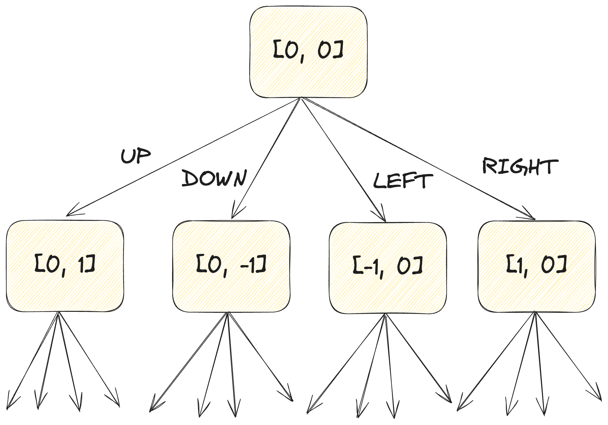
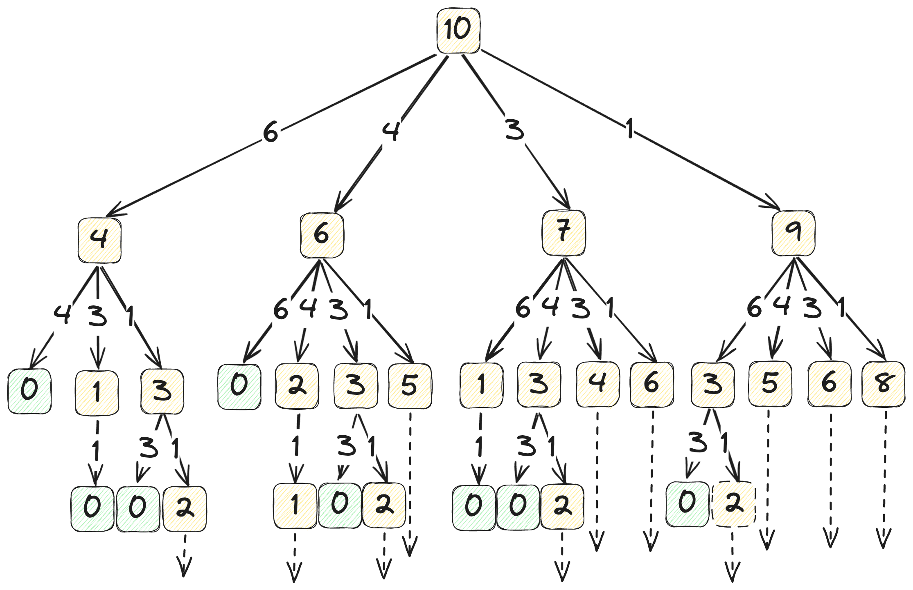

7/27/2024: admittedly this blog post might read easier on my [previous site](https://v1.nickkeil.com/blog/2)

<hr>

> "Those who cannot remember the past are condemned to repeat it."

Who cares about dynamic programming? Me, for some reason.

Why do I care about dynamic programming? Do I work in a technical landscape where I solve dynamic programming problems frequently? No, I've never used it a real life application. Am I a competitive programmer who just loves solving coding problems in my spare time? Nope, not a chance. So what gives? Well, I'm job hunting and for whatever reason, knowing how to solve dynamic programming problems is part of the secret handshake in order to get a tech job.

Okay I get it, but why the blog post?

One, I've been looking for another blog topic for some time and this happened to be something I felt particularly experienced enough to talk about. Two, there are a lot of common mistakes I've encountered that I thought would be worth sharing. Three, you understand a topic better once you've explained it to someone else, so writing this is my selfish way of consolidating knowledge.

So, without further [ado](https://www.merriam-webster.com/dictionary/ado), let's get into the details.

## Part 1: What is Dynamic Programming?

You might think that dynamic programming means programming that is dynamic. We'll you'd be wrong, as long as you were thinking of programming in the traditional sense. The word "program" here is referring not to a computer program, but to a schedule of sorts, a series of decisions. "Dynamic" refers to the nature of time manipulation used to iterate through these decisions in order to find the optimal result.

The more fundamental idea that dynamic programming is built off of is **backtracking**, where you traverse a decision tree seeking out the best possible path. In backtracking, at any point along a path, you are given some number of choices. Making any of these choices will bring you to another state, which itself will have some number of choices. In a recursive manner, you'll search through each of these choices, reaching some base case in each, and aggregate the results of these searches to produce the overall result.


_For traversing some 2D maze, you can imagine a backtracking decision tree looking something like this._

The problem is backtracking can get _really_ inefficient. With a branching factor of 4, searching the whole tree has a runtime of O(4^n). Not ideal. In some cases, we can use dynamic programming to achieve something faster. How do we know if DP applies? There are a few key signs to look out for:

1. It'll usually be an optimization problem where you're trying to find the maximum or minimum result in some problem space.
2. At each decision point, the optimal solution must be solvable using the optimal solution to each sub-problem. In other words, split, solve, and combine.
3. We must be able to solve a subproblem _independently_ of the steps taken to reach it.
4. You'll be running into the same problems over and over again. Optimizing this repeated work is one of the primary focuses of dynamic programming.

Let's think back to that decision tree from earlier. Consider an example where you are running an M&M factory. You have N machines, and each one can produce an M&M of a different weight. You want to achieve a specific weight K using the minimum number of M&M's. At any point, we can make a decision of producing one M&M of a specific weight, which will reduce the remaining weight we need to achieve. We want a function Q(K) which returns the minimal number of M&M's possible to achieve weight K using the machines available.


_Example with a target weight of 10 and machines that produce weights 6, 4, 3, and 1 respectively._

The total runtime of iterating through all possible paths is O(n^k) which is not ideal. Notice that if we choose machine 6, we reach the same remaining weight (4) as if we chose machine 3 twice. Do we really need to solve the subproblem K = 4 twice? What if we just kept a hash map to keep track of our previous results? Something like this:

```ts
const memory = {};

function Q(k: number) {
  if (k in memory) return memory[k];
  // else, solve normally
}
```

Well there you go, you just created **top-down** dynamic programming. We call it top-down because we're starting at the top of the tree, and constructing our memory (really it's called a memoization table) as we traverse down the branches. There's just a few more parts we're missing, those being the base case and the recursive step. The base case is pretty simple: if our weight is 0, we've already achieved our target, so we return 0 M&M's needed.

Considering the recursive case, we want to think about how we can construct Q(K) from the results of our subproblems. First, we'll only want to consider using the machines that won't over do it (i.e. produce more weight than we need). Then, for the remaining machines, we'll take their value and subtract it from K, leaving us with the remaining weight, and then run a recursive call on that value. From these results, we take the best one, that being the minimum. So something like this:

<!-- prettier-ignore -->
```ts
machines = machines.filter(m => m <= k);
values = machines.map(m => Q(k - m));

Q(k) = 1 + Math.min(...values);
```

The next key insight is realizing that with this recurrence relation, calls to this function only depend on recursive calls of _smaller values_. So what if instead of starting from the biggest weight, we started with the smallest base case and built our way up from there? Thus we arrive at the **bottom-up** approach. Bottom-up is typically non-recursive, which makes it more efficient by not consuming as much call stack memory.

## Part 2: How to totally misunderstand the point of dynamic programming

### 1. Use Top-Down DP Without Memoization

This is one of the most obvious signs that you don't actually understand dynamic programming. Top-down DP without memoization is just backtracking, meaning you are performing every recursive call all the way through without saving the results of your repeated work. This usually results in an exponential rather than polynomial runtime. I actually did this in an interview once. Never again.

### 2. Confusing DP with Greedy

Dynamic programming and greedy problems are a lot alike. They both involve making decisions at specific points in an algorithm and collecting the results of those decisions to construct the overall result. But greedy is an optimization of DP that applies in specific cases. Think about whether the decision you're making is really a decision, or if the answer will always align with some heuristic. If you want money, you take the largest bill; it's not much of a decision.

### 3. Assuming you can use DP on any Recursive Problem

Many problems can be broken down into subproblems, but that doesn't mean you can always use dynamic programming.

Here's an example: Given a graph G, find the longest path from vertex V to vertex W without repeating edges. At first glance, you might think that from each vertex, you have a clear decision point, where you decide which edge to follow, and a clear subproblem of where to go once you've reached the next vertex. But here's the problem. Each vertex is trying to find the longest path to W right? So why wouldn't it go _back_ through the previous vertex, and then back again, creating an infinitely long path? Path length is what it's optimizing for after all. The only way we can avoid this is by keeping track of which vertices we've already visited. However, this breaks rule 3, that being that subproblems should be solvable independent of one another. If we were to include this data in the memoization, suddenly our memo table becomes a whole lot more complicated.

## Conclusion

So yeah, dynamic programming is hard, yada, yada, yada. But like any difficult thing, practice makes perfect. The more patterns you encounter and internalize, the easier it gets. So what are you doing still doing here?
