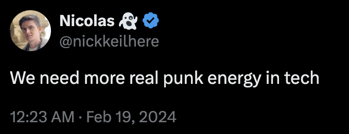
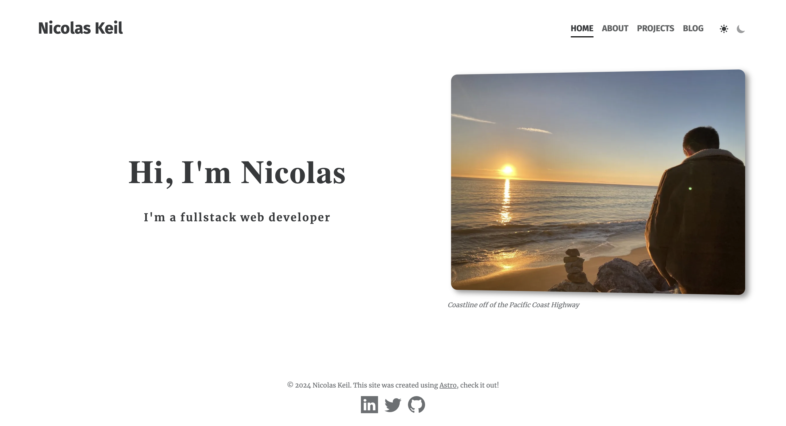
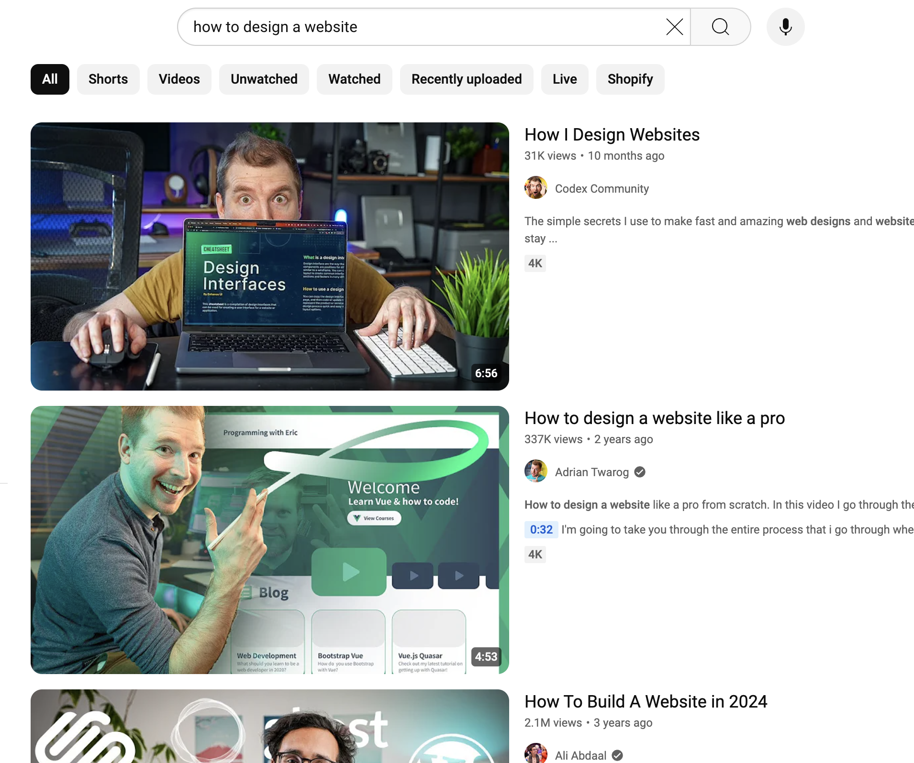
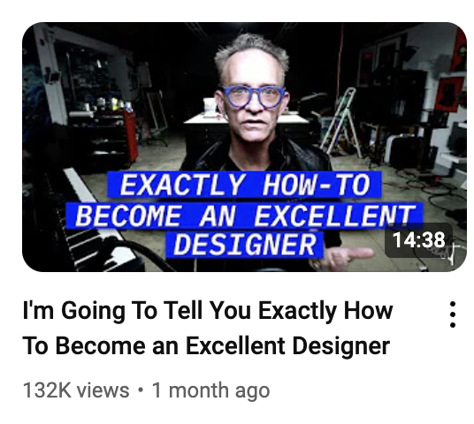
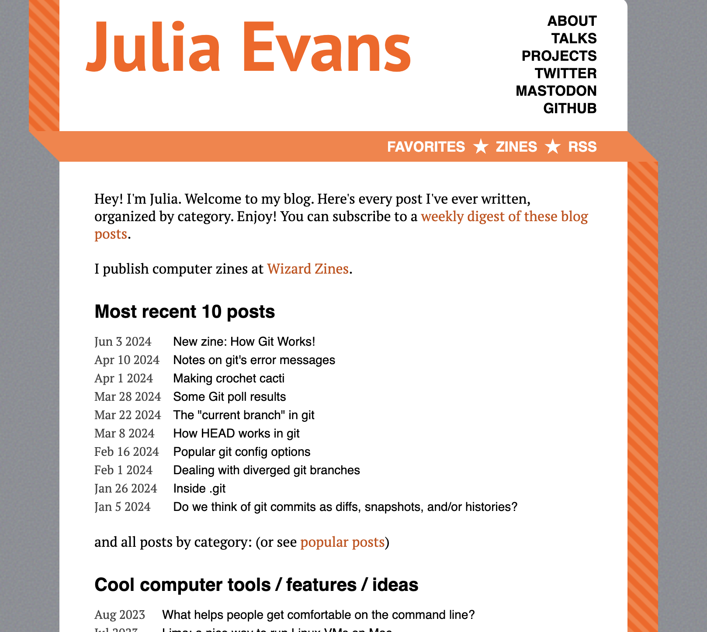
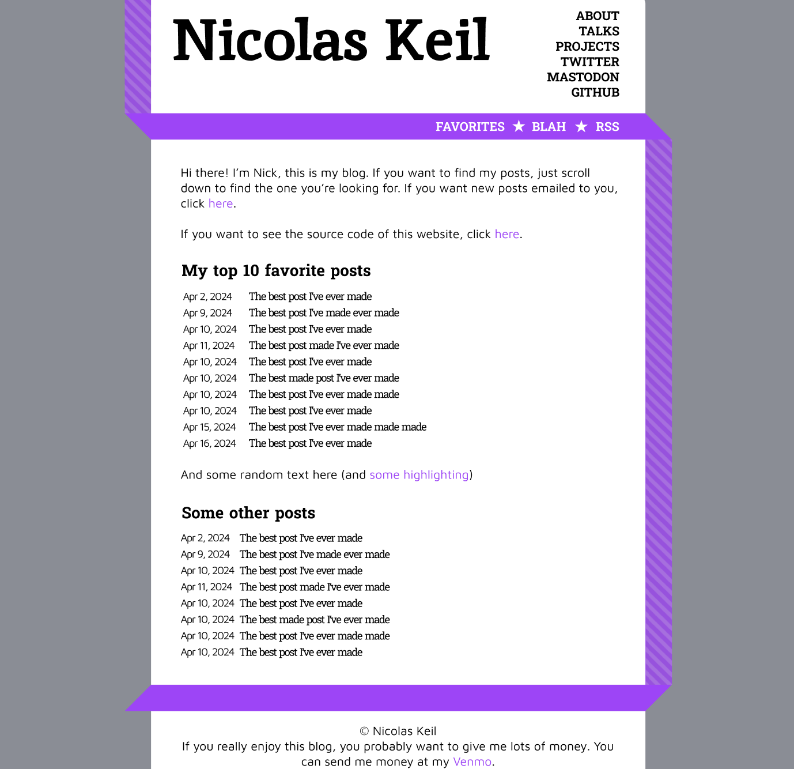
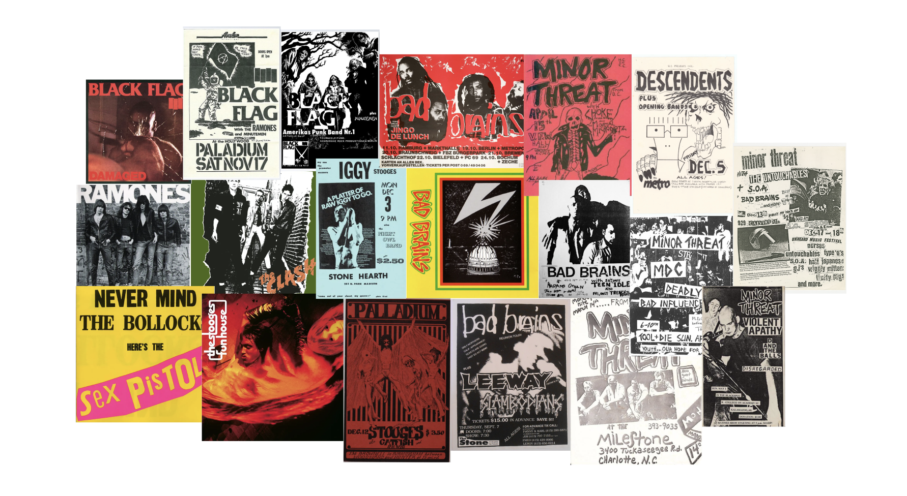
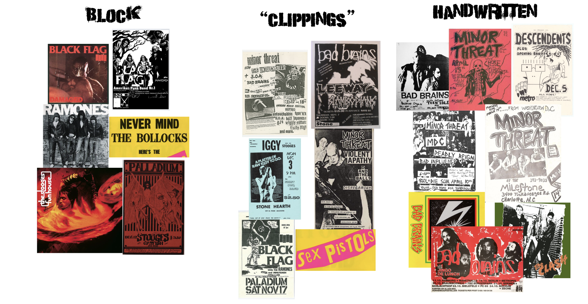
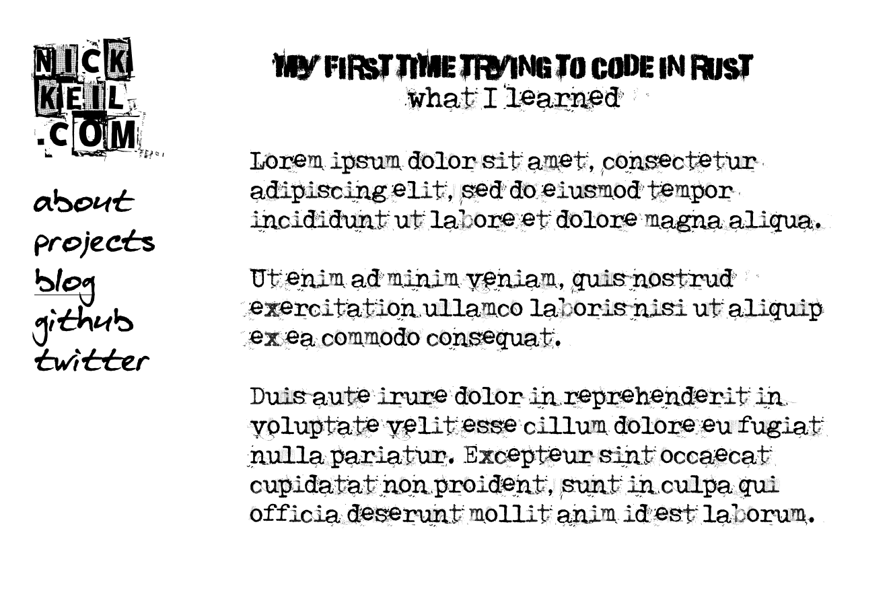

I am not a designer. But I’m also not _not_ a designer.

Let’s start over.

This is what my website used to look like:

_"minimalism is the new creativity"_

You probably see that and think, "yeah that’s fine". But that’s exactly my problem. It [took me a while](/blog/1) to actually get it running, but my old website was the [epitome](https://en.wikipedia.org/wiki/Epitome) of not knowing how to represent myself and falling in line with almost every other portfolio out there.

As someone new to social media and really any sort of public persona, joining "the discourse", which in a sense my website was doing, was a big deal. _That_ was the barrier I was breaking. Just having something out there. I took a template, added some pictures and animations, and changed some fonts around. But I didn’t have the confidence, technically or personally, to go beyond that. And I [knew this](/blog/1#get-a-first-iteration-out-asap):

> I can’t emphasize enough how much easier it is to go from v1 to v2 than it is to get v1 out. The faster you finish the first iteration, the faster you can start noticing what can be improved.

As expected, soon after publishing, I was already thinking about all the ways I could make it better. Though I did incrementally improve it over time, there's only so many flowers you can arrange around a piece of crap before you realize you aren't getting anywhere.

## Part 1. Opening Doors

How do you start something you have no idea how to start?

Ah the early days of web dev when everything seemed like a convoluted mess of technologies. I don’t miss having no idea how to persist a checkbox value on refresh. But I seem to find myself here again. How the hell do I design a website?

Searching "how to design a website" on youtube gives me a plethora of relevant content:

_don’t these thumbnails scream "interesting" to you?_

This has always been a problem with youtube and search engines in general. If you don’t know what you’re looking for, a general search query will give you the most bland results imaginable. You have to really be intentional to find the gems underneath all the slop. (Yes, humans were flooding the internet with mind-numbing garbage long before [AI](https://x.com/facebookaislop)).

After some days of trying to hit gold in the caves of design youtube, [this video](https://www.youtube.com/watch?v=2zK3NYYOwaM) found its way into my feed:

Clickbait aside, this guy just came across as more real than all of the other "design influencers" I was watching. He felt like someone with the experience to back up what he was saying.

The part that really stuck out to me was:

> Until you know what you’re doing, you’ve got to copy everything. Look around you at excellent examples of design and then rip them off until you get a clue.

So I copied a website.

## Part 2. Copying a website

Throughout this time, I’d been collecting bookmarks of blogs or sites that I found cool or that I wanted my site to look like. But opening up Figma still intimidated me. I had no idea where to start. That’s why this advice was so helpful; the bounds of an existing design creates a safety net of a clearly laid out task from which to learn from.

The one I decided to copy was this site by [Julia Evans](https://jvns.ca/):

It’s standard enough to be a good starting point, while still being a little alternative in terms of the navigation and page layout.

My goal was to replicate this in Figma while making a few key modifications in color palette and fonts.

Here’s what I ended up with:

_not totally terrible_

After pulling this off, I knew the basic workflow of Figma, was getting comfortable creating layouts and choosing colors, and had dipped my toes into the vast world of font selection. Now it was time to start from scratch.

## Part 3. Off the Beaten Path

Let’s start with my goals. What were my intentions with this design, and what was my high-level inspiration?

What immediately came to mind was music. Songs and albums exist at the core of almost every [facet](https://en.wikipedia.org/wiki/Facet) of my life (future blog post coming soon?), so the idea of having a music-inspired website had been bouncing around my head. I wanted this site to represent me, so it should carry my spirit in its visual style.

I started with the idea of a design reminiscent of classic punk posters. High contrast, simple colors, and slightly chaotic. I collected a bunch of images from the internet that hit the aesthetic I was going for:

And then organized them to try and pick out some common ideas:

My notes were as follows:

- contrast
  - light/dark
  - different fonts
  - mess/order
- simplicity
  - limited colors
  - no gradients
  - no color photos
- in your face
  - attention-grabbing
  - aggressive imagery
- homemade feel

Seemed like a good place to start.

After finding some cool punk-inspired fonts, I came up with this v1 design:

_no, I never plan on actually writing a blog post about rust_

This is actually starting to feel kind of fun.

Let me get sidetracked real quick about how I ended up with a typewriter font for the content text. I skipped the part of the story when my _first_ first idea was making a typing practice website which felt like you were typing on a typewriter. It was supposed to feel kind of dingy but also have this really sick realistic design. I wanted to use real images for the typewriter, the paper, and the background to get as immersive as possible. It would even have an intractive lightbulb that [wouldn’t be copied at all](https://x.com/jh3yy/status/1327686213432717313). Little did I know how hard this was going to be. I lost interest around the point of trying to find an actually usable typewriter image. As much as I want to care enough to learn to type at 200WPM, I really don’t. But the typewriter font stuck around.[^1]

[^1]: To see what this idea eventually turned into, see [this post](/projects/typing-executioner). But be warned, it makes loud noises and had no design forethought whatsoever.

Anyway, log story short, I ended up on the design you see today. Here's a full screenshot of all the figma prototyping I did:

_ignore the weird landing page image I tried to design_

Now we're really getting somewhere. I've got color themes, a header image (designed with [Affinity](https://affinity.serif.com/) because I'm an adult now who doesn't pirate photoshop), and several pages of fascinating content. Now that the hard part's out of the way, I just need to code it up, which should be the easy part right? After all, I do this for a living.

## Part 4. Okay, I'll Admit it was Harder than I Thought

A number of things came up when implementing my design that I hadn't thought of at all beforehand:

- How to actually get a paper texture to work (in Figma I just used a built-in filter)
- Loading numerous custom fonts and avoiding [FOUT](https://css-tricks.com/how-to-load-fonts-in-a-way-that-fights-fout-and-makes-lighthouse-happy/)
- How to let the user select between different themes
- How to style markdown within blog posts
- How to display images and code embedded within blog posts
- Mobile responsiveness (I still haven't gotten around to this as of writing)

While a responsible decision would have been to return to figma and draft some new designs, this is my website so I can do whatever I want. I ended up just figuring it out as I went along. I might cover some of these topics in future blog posts (but probably not).

## Part 5. Conclusion

I am of the opinion that websites have gotten too boring and conformist recently. You never really notice great websites that much nowadays unless you're [really](https://dimden.dev/) [looking](https://antfu.me/). Not to mention that [every](https://astro.build/) [single](https://nextjs.org/) [tech](https://www.prisma.io/) [website](https://nuxt.com/) [looks](https://vuejs.org/) [exactly](https://laravel.com/) [the](https://tailwindcss.com/) [same](https://plausible.io/). I was almost tempted to pull an [Andrew Kelley](https://andrewkelley.me/) and go full tech anarchist, but design is something I genuinely wanted to get better at. Plus I've been dying for something to sink my time into outside of work.

One of the driving philosophies behind my new site was to look like nothing else out there. To convey a feeling rather than achieving some arbitrary utility. You can be the judge of whether I succeeded, but either way I'm just gonna keep on doing my thing.

(P.S. click [here](https://github.com/nkeil/website-2) if you wanna see the source code)
